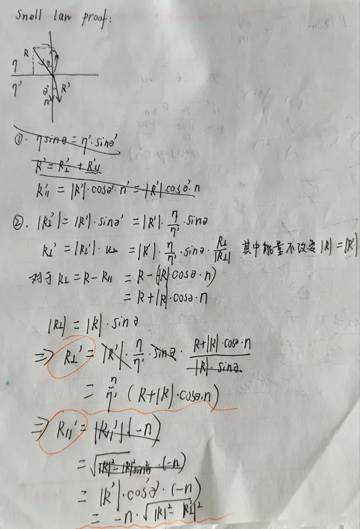

# my-ray-tracing

在基于递归构建光追（path tracing）的基础上，加入了BVH和SVH加速结构
  没有加速结构，cpu模拟渲染近三小时，180分钟左右
  
  bvh之后： 运行时间: 5078007 毫秒   84.63分钟
  
  sah之后：运行时间： 4964460 毫秒   82.74分钟
  
ray-tracing mat材质
反射模糊
模糊球体尺寸与反射效果的关系
模糊球体半径越大，反射效果越模糊。原理：模糊球体半径定义了反射方向的随机扰动范围，半径增大导致反射光线方向分散性增强
1. 模糊参数的物理意义
因此可引入模糊度参数，即球体半径（半径=0表示无扰动）。"
设计逻辑：该参数直接映射到着色器的浮点变量，零值关闭模糊效果
2. 掠射光线的异常处理
技术难点在于：过大球体或掠射光线可能导致散射至表面下方。解决方案是令表面直接吸收此类光线。
原因：大半径扰动或低角度入射时，随机偏移可能使反射向量指向物体内部（即dot(normal, scattered_ray) < 0），此时强制返回黑色或终止光线追踪
3. 反射向量的归一化必要性
需注意：模糊球体的比例需与反射向量一致，但反射向量长度可能任意变化。
问题根源：未归一化的反射向量长度不固定（如镜面反射向量长度为入射向量长度），直接叠加球体扰动会导致缩放失真
4. 解决方案：向量归一化，因此必须对反射向量进行归一化处理。
实现方式：计算反射方向后立即执行 reflected_ray = normalize(reflected_ray)，确保扰动球体在单位向量空间生效
折射材质  玻璃

在归一化后R的值一般为1
进一步完善折射定律
注意理解反射率R，本质上其实就是概率，除开正常的折射定律，加入概率的因素模拟正常扰动
